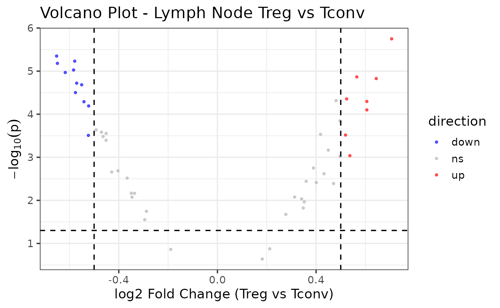

# Differential Expression Analysis via R Studio

Designed for RNA-seq workflows, **JW26ADS8192** provides a streamlined
pipeline to differential expression results. Use a SummarizedExperiment
object through the R package interface

------------------------------------------------------------------------

## Step 1: Install JW26ADS8192 from GitHub

``` r
remotes::install_github("wilsonjewel27/JW26ADS8192")
```

------------------------------------------------------------------------

## Step 2: Load the following libraries & example dataset

``` r
#Required Libraries
library(JW26ADS8192)
library(ggplot2)
library(SummarizedExperiment)
library(DESeq2)
library(apeglm)    
library(stats)
library(rlang)
library(utils)
library(readr)

#example SummarizeExperiment Data Set
data("example_se")
```

------------------------------------------------------------------------

## Step 3: Start the Differential Gene Expression Analysis

### Step 3.1: Determine the Low Expression Filter Threshold

Evaluate model performance across different threshold values and select
the best one.Replace `group_var` with the column to be categorized.
Default `group_var` = “cell-type”. Replace `ref_level` with a specific
cell type to be reference. Default `re_level` = “Tconv”. Replace
`assay_name` with the appropriate label. Default \`assay_name =
“counts”.

``` r
example_se_filtering_assessment <- determine_filter_threshold(
  se_ln             = example_se,
  count_thresholds  = c(0, 1, 5, 10, 20, 50, 100, 200, 500),
  assay_name        = "counts",
  ref_level         = "Tconv",
  group_var         = "cell_type",
  p_threshold       = 0.05
  )
  
example_se_filtering_assessment
```

    ##   threshold n_tested n_significant
    ## 1         0       50            47
    ## 2         1       50            47
    ## 3         5       50            47
    ## 4        10       50            47
    ## 5        20       50            47
    ## 6        50       50            47
    ## 7       100       50            47
    ## 8       200       50            47
    ## 9       500       50            47

### Step 3.2: Filter Low Expression Genes

Using the threshold value determined in Step 1, manually replace the
`min_count_per_gene` variable and filter. Use the same SE utilized in
Step 1. Default `min_count_per_gene` = 10. Replace `assay_name` with the
appropriate label. Default \`assay_name = “counts”.

``` r
se_filtered <- filter_low_exp_genes(
  se_ln               = example_se,
  min_count_per_group = 10,
  assay_name          = "counts"
  )
```

### Step 3.3: Differential Gene Expression Analysis via DESeq2

With the remaining filtered genes, preform DESeq2 to analyze the gene
expression. Replace `group_var` with the column to be categorized.
Default `group_var` = “cell-type”. Replace `ref_level` with a specific
cell type to be reference. Default `re_level` = “Tconv”

``` r
se_dge <- run_DESeq2(
  se_ln     = se_filtered, 
  group_var = "cell_type", 
  ref_level = "Tconv"
  )
```

### Step 3.4: Apply log2_shrinkage on DESeq2 results to improve estimates.

Replace `shrinkage` with the appropriate GLM estimator. Default
`shrinkage` = “apeglm”.

``` r
se_dge_shrink <- log2_shrinkage(
  dds       = se_dge, 
  shrinkage = "apeglm"
  )

se_dge_shrink
```

    ##       baseMean log2FoldChange     lfcSE       pvalue         padj  gene
    ## gene1 148.4587      0.4495101 0.1439740 0.0006820103 0.0012629820 gene1
    ## gene2 137.6677      0.5369061 0.1829566 0.0009169960 0.0016374929 gene2
    ## gene3 142.6000      0.2120192 0.1586138 0.1333416729 0.1388975760 gene3
    ## gene4 151.4552      0.5651548 0.1392639 0.0000136085 0.0000930082 gene4
    ## gene5 145.1170      0.3479454 0.1601443 0.0150181025 0.0170660255 gene5
    ## gene6 153.9560      0.2772997 0.1299213 0.0211811995 0.0230230429 gene6

### Step 3.5: Intrepret the Gene Regulation

Summarize the non-significant and up and down regulated genes in the
data set. Replace `p_threshold` with the appropriate adjusted p-value
threshold. Default `p_threshold` = 0.05. Replace `fc_threshold` with the
appropriate fold-change threshold. Default `fc_threshold` = 0.5.

``` r
DESeq2_gene_reg_summary <- gene_regulation_summary(
  res_df       = se_dge_shrink,
  p_threshold  = 0.05,
  fc_threshold = 0.5
  )

DESeq2_gene_reg_summary
```

    ##   direction count
    ## 1      down    11
    ## 2        ns    31
    ## 3        up     8

### Step 3.6: Visualize Expression

Generate a volcano plot to visualize the `gene_reg_summary` results. Use
the same `p_threshold` and `fc_threshold` values utilized in Step 5.
Replace `set_title` with the correct title. Default `set_title` =
“Volcano Plot - Lymph Node Treg vs Tconv”. Replace `xlab` with the
correct x-axis title. Default `xlab` = “log2 Fold Change (Treg vs
Tconv)”.

``` r
example_se_volcano <- generate_volcano(
  res_df       = se_dge_shrink,
  fc_threshold = 0.5,
  xlab         = "log2 Fold Change (Treg vs Tconv)",
  set_title    = "Volcano Plot - Lymph Node Treg vs Tconv",
  p_threshold  = 0.05
  )

example_se_volcano
```



### Step 3.7: Export Results

Export the se_dge_shrink, DESeq2_gene_reg_summary,
example_se_filtering_assessment data frames as TSV tables and volcano
plots as a PDF and PNG images. Outputs will export as “de_output” to
current working directory unless explicitly indicated.

``` r
example_se_exports <- export_outputs(
  res_df         = se_dge_shrink,
  summary_df     = DESeq2_gene_reg_summary,
  filtering_diag = example_se_filtering_assessment,
  volcano        = example_se_volcano,
  output_dir     = file.path(tempdir(), "de_output") 
  )
```
